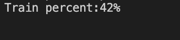
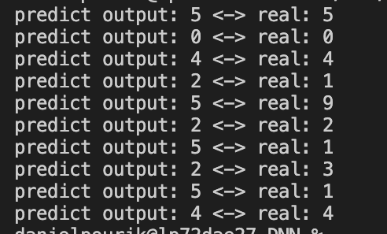

# SimpleNeuralNetwork
Image classification with MNIST dataset and dynamic hidden layers

Simply run <b>python3 runTest.py</b>

The progress will show you the percentage of 600000 mnist images: 

Custom dataset also can train with a range of 0. to 1. for each pixel, thus, images should be divided by 255.

img 
= img  / 255.0 

This is some red text.

Current output shows, up to 10 images, but it can be changed to <b>any value</b>

